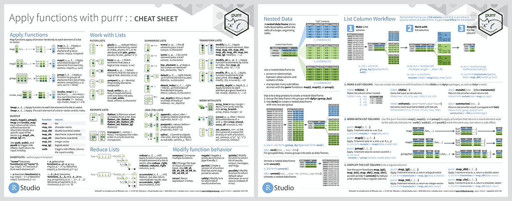
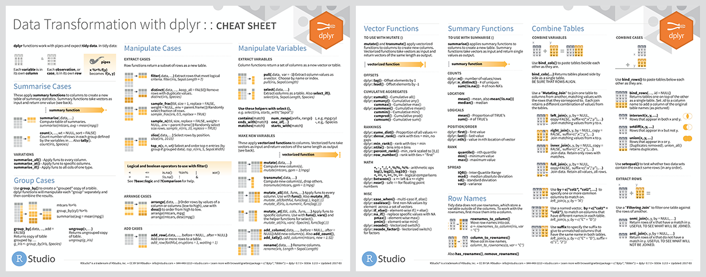
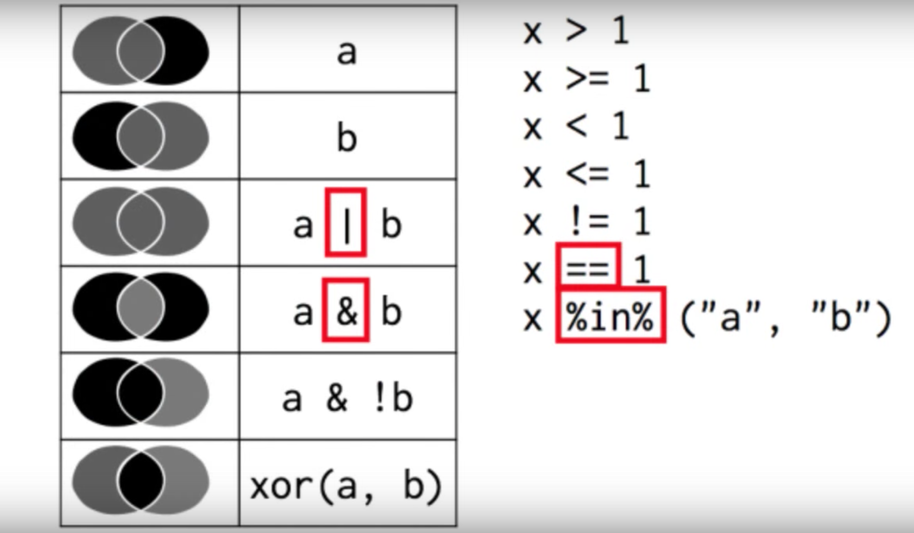
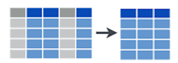
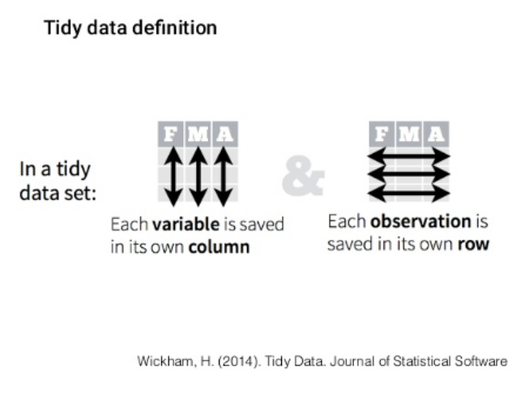

```{r setup, include=FALSE}
options(htmltools.dir.version = FALSE)
# options(crayon.enabled = TRUE)
load('data/data_workshop.Rdata')
```

# The tidyverse

The **tidyverse** is a collection of R packages designed for data science, as a suite aimed at easening the data analysis in all its steps.

Created by Hadley Wickham, chief scientist of RStudio, and author of more than 30 R packages (`readr`, `ggplot2`, `plyr`, `devtools`, `roxygen2`, `rmarkdown`...). All packages share an underlying design philosophy, grammar, and data structures. 

The contents in this documente were adapted from @Ameztegui2019.

## The *tidyverse* and tidy data

Data in **tidy** format eases the processing and analysis, particularly in vectorized languages as R. Data has to meet some requirement in order to be considered *tidy*:

* Each row represents an observation
* Columns comprise variables
* Echa combination of row and column gathers a value


There are 5 examples of messy data we will explore here:

* `Column headers are values, not variable names.`
* Multiple variables are stored in one column.
* Variables are stored in both rows and columns.
* Multiple types of observational units are stored in the same table.
* A single observational unit is stored in multiple tables.

## So what's exactly *in* the tidyverse?


* `ggplot2` a system for creating graphics, based on the Grammar of Graphics

* `readr` a fast and friendly way to read rectangular data (csv, txt...)

* `tibble` a tibble is a re-imagining version of the data frame, keeping what time has proven to be effective and throwing out what has not

* `stringr` provides a cohesive set of functions designed to make working with strings as easy as possible

* `forcats` provides a suite of useful tools that solve common problems with factors

* `dplyr` provides a grammar of data manipulation, providing a consistent set of verbs that solve the most common data manipulation challenges
 
* `tidyr` provides a set of functions that help you get to tidy data
 
* `purrr` enhances functional programming (FP) toolkit by providing a complete and consistent set of tools for working with functions and vectors


## Installation and use

 - Install all the packages in the tidyverse by running `install.packages("tidyverse")`

 - Run `library(tidyverse)` to load the core tidyverse and make it available in your current R session.
 - Learn more about the tidyverse package at http://tidyverse.tidyverse.org.
 - Or check the cheatsheets
 
 

# Before we start...

- Neither `tidyr`, nor `dplyr` or `purrr` do anything that can't be done with base R code, `apply` family functions, `for` loops or other packages.  

- Designed to be more efficient (in time), easier to read and easier to use. More intuitive to use, specially for beginners (it may require some adaptation if you are used to base R code).

- Valid mostly for data.frames. For other formats (matrices, arrays) `plyr` can be used.


# Our data

  1. `plots [11858 x 15]`: all plots from the Third Spanish Forest Inventory (IFN3) in Catalonia  

  2. `trees [111756 x 12]`: all trees with dbh > 7.5 cm measured in both
     IFN2 and IFN3  

  3. `species [14778 x 15]`: number of trees per hectare in each plot, by
     species and size class  

  4. `coordinates [11858 x 6]`: X and Y UTM coordinates of each plot.  

  5. `leaf [10447 x 3]`: leaf biomass and carbon content for those IFN3 plots where they were available  


# A brief introduction of data managment with `dplyr`

## Let's have a look at the data

Data inspection must be the first thing we do before starting any kind of analysis.

```{r, echo=FALSE, message=FALSE, warning=FALSE}
library(tidyverse)
load('data/data_workshop.Rdata')
options(width = 85)
```

```{r tibbles, }
trees
```

```{r, echo=FALSE, message=FALSE, warning=FALSE}
options(width = 85)
```

```{r plots, }
plots
```

```{r, echo=FALSE, message=FALSE, warning=FALSE}
options(width = 85)
```

```{r species, }
species
```

```{r tibbles_class, }
class(trees)
```

Tibbles, are not usual data.frames:

  - class `tbl_df`
  
  - print only 10 rows by default
  
  - informs about variable types
  
  - Besides that, it is like a data.frame
  (it *is* a data.frame)


```{r tibbles_glimpse, }
glimpse(trees)
```


## {width=40px} dplyr

`dplyr` is a grammar for data manipulation, providing a consistent set of *verbs* that help you solve the most common data manipulation challenges:

## The 5 main verbs of dplyr

  - `filter`: keep/select the rows that match a given condition
  
  - `select`: keep columns by name
  
  - `arrange`: sort rows acording to a given variable
  
  - `mutate`: transform existent variables or create new ones
  
  - `summarise`: do some summary statistics and reduce data
  


## Common structure

Most of the tidyverse verbs/functions share certain elements in common:

```r
verb(data, ...)
```

- First argument: data (as data.frame or `tbl_df`)
- The rest of arguments specify what to do with the data frame
- Output is always another data frame (tbl_df or data.frame)
- Unless we are assigning (`<-`), functions never modifies the original data

### Selecting rows (`filter`)

Use `filter()` to choose rows/cases/observations where a given condition(s) is true. 

{width=250px;align=center}

Select trees taller than 6 meters:

```{r, filter_ex}
filter(trees, HeiIf3 > 6)
```

Select trees in province 50, Zaragoza:

```{r, filter_ex2}
filter(trees, Provincia == '50')
```

```{r, filter_ex3}
filter(trees, CD %in% c(45, 70))
```

{width=250px}
**Exercise 1**
```
Let's find those plots in IFN3n (`plots` data frame) that:

  1.1 Are located either in Barcelona (08) or Girona (17)
  
  1.2 Were measured **in** January 2001
  
  1.3 It took **more** than 2 hours to measure (7200s)
```


### Selecting columns (`select`)

`Select()` it's the function in dplyr to choose variables from a `tbl`. It keeps only the variables you mention.

{width=250px}

```{r select_data}
trees
```

Selecting a single column/variable:

```{r select_ex}
select(trees, DiamIf3)
```

Selecting all columns but the targeted one:

```{r select_ex2}
select(trees, -Codi)
```

Selecting several columns:

```{r select_ex3}
select(trees, DiamIf2, DiamIf3)
```

Selecting a range of columns:

```{r select_ex4}
select(trees, Codi:Dist)
```

We can leverage some special functions especifically design to work withwith strings to enhance column extraction:

- `starts_with(x)`: names that start with x
- `ends_with(x)`: names that end with x
- `contains(x)`: selects all variables whose name contains x
- `matches(x)`: selects all variables whose name contains the regular expression x
- `num_range("x", 1:5, width = 2)`: selects all variables (numerically) from x01 to x05
- `one_of ("x", "y", "z")`: selects variables provided in a character vector
- `everything()`: selects all variables

Select columns that start with `Diam`:

```{r select_ex5}
select(trees, starts_with('Diam'))
```

**Exercise 2**
```
Think of three or four ways to select the variables that define the start and finish date of plot measuring.
```

### Sorting rows (`arrange`)


```{r arrange_ex}
arrange(trees, Dist)
```

```{r arrange_ex2}
arrange(trees, desc(Dist))
```

**Exercise 1**
```
  3.1 Sort plots by date and hour of measurement
  
  3.2 Which plots were started to be measured later in the day?
  
  3.3 Which plots took longer to be measured?
```

### Transforming variables (`mutate`)

`mutate()` allows to create/calculate new columns/variables in our dataset.


```{r mutate_ex}
mutate(
  trees,
  Dist = Dist * 100
)
```

```{r mutate_ex2}
mutate(
  trees,
  Alometria = DiamIf3 / HeiIf3,
  Alometria2 = Alometria * DiamIf2
)
```

### Special functions:

- `if_else` allows to implement a conditional structure in which we determine the output value when that condition was met and the value when it happens otherwise:

```{r if_else}
mutate(
  trees,
  Especie = if_else(Especie == '021', 'Pinus sylvestris', 'Other')
)
```

## Exercise 4

  4.1 Get diameter growth (in cm) of each tree between IFN2 (DiamIf2)  and IFN3 (DiamIf3)

  4.2 Create two new variables with basal area of each tree (in $m^2$ per hectare), both for IFN2 and IFN3. Which is the species of the fastest-growing tree in basal area?

<br>

.center[Clue:]
$$
AB = \frac{\pi}{4} · Diam^{2} · N
$$

## Reducing variables (`summarise`)


```{r summarise_ex}
summarise(trees, mean_if3 = mean(DiamIf3))
```

### Summary functions

  - `min(x)`, `max(x)`, `quantile(x, p)`
  
  - `mean(x)`, `median(x)`, 
  
  - `sd(x)`, `var(x)`, `IQR(x)`
  
  - `n()`, `n_distinct(x)`
  
  - `sum(x > 10)`, `mean(x > 10)`


### Grouped summarise

One of the most common ways in which we create summaries is by grouping on the basis of certain information. That means, we split observations between a number of groups and the calculate the summary statistics.

```{r grouped_summ_ex}
by_province <- group_by(trees, Provincia)
by_province
```


```{r grouped_summ_ex_2}
summarise(
  by_province,
  mean_height_ifn3 = mean(HeiIf3, na.rm = TRUE),
  max_height_ifn3 = max(HeiIf3, na.rm = TRUE),
  min_height_ifn3 = min(HeiIf3, na.rm = TRUE)
)
```
**Exercise 5**
```
  5.1 Which species showed the largest increase in diameter between IFN2 and IFN3?

  5.2 Which province gather the largest number of species?
```
### `summarise_if` and `summarise_at`

We can apply a summarising function to a group of variables that share some commmon characteristics that can be tested (i.e. numeric variables)

```{r summarise_if}
summarise_if(trees, is.numeric, mean)
```

We can limit the summary by name or using the select helpers (`starts_with`, `ends_with`, `one_of`)

```{r summarise_at}
summarise_at(trees, vars(starts_with('Diam')), mean)
```


### Targeted transformations

The same can be done with `mutate`:


```{r mutate_if}
mutate_if(trees, is.numeric, log)
```

```{r mutate_at}
mutate_at(
  trees, vars(one_of(c('Especie', 'Species'))),
  ~ paste0('sp_', .x)
)
```

# Pipes and data pipelines (`%>%`)

Often, we will need to use several verbs (`filter`, `arrange`, `group_by`, `summarise`...) to manage our data towards a final result. However, multiple operations are difficult to read, or require to create multiple intermediate objects to achieve our goal:

In programming languages this is usually solved nesting functions one inside another, so that we applie and ordered sequence of instructions to our data:

```{r bad_left, eval = FALSE}
diam_especie <- filter(
  summarise(
    group_by(
      filter(
        trees, !is.na(DiamIf3)
      ),
      Codi, Especie
    ),
    diam = mean(DiamIf3),
    n = n()
  ),
  n > 5
)
```

```{r bad_right, eval = FALSE}
no_na_trees <- filter(
  trees, !is.na(DiamIf3)
)
no_na_trees_grouped <- group_by(
  no_na_trees, Codi, Especie
)
summarised_no_na_trees <- summarise(
  no_na_trees_grouped,
  diam = mean(DiamIf3), n = n()
)
final_data <- filter(
  summarised_no_na_trees, n > 5
)
```

The tidy approach solves this issue, producing a way better coding experience (cleaner and easy to read) by means of its alternative *pipe* operator (`%>%`) from `magrittr` package
  
The name *pipe* refers to the ability of *connecting* the input on the left side passing it to the function in the right as its first argument:
  
  `f(x, y)` is the same as `x %>% f(y)`  
  `f(x, y, z)` is the same as `x %>% f(y, z)`

Summing up, in the tidyverse `%>%` makes each function to be applied to the data frame resulting from the previous step.
  
  `filter(df, color == 'blue')` is the same as `df %>% filter(color == 'blue')`  
  `mutate(df, double = 2*value)` is the same as `df %>% mutate(double = 2*value)`

**Untidy**

```{r bad_left_2, eval = FALSE}
diam_especie <- filter(
  summarise(
    group_by(
      filter(
        trees, !is.na(DiamIf3)
      ),
      Codi, Especie
    ),
    diam = mean(DiamIf3),
    n = n()
  ),
  n > 5
)
```

**Tidy**

```{r ok_right, eval = FALSE}
diam_especie <- trees %>%
  filter(!is.na(DiamIf3)) %>%
  group_by(Codi, Especie) %>%
  summarise(
    diam = mean(DiamIf3),
    n = n()
  ) %>%
  filter(n > 5)
```

**Exercise 6**

```
Create pipelines to answer the following questions:

  6.1 Which **plots** have the fastest average growth rate?
  
  6.2 Which is the plot with the **most species**?
  
  6.3 Is there any **relationship** between both variables? <br>
  *(Optional, some knowledge on `ggplot`is required)*
```
### Grouped `mutate`/`filter`

We will commonly use groups (`group_by`) when summarising variables (*n* inputs, one output):

```r
group_by(Especie) %>% summarise(mean = mean(Diam))
```

{width=250px}

Sometimes, however, we may be interested in calculating new variables by group, but without reducing the dimensions:

{width=250px}

```{r eval = F}

trees %>%
  group_by(Especie) %>%
  mutate(
    std_diam = DiamIf3 - mean(DiamIf3)
  )
```

```{r echo=F}
options(width=100)
trees %>%
  group_by(Especie) %>%
  mutate(
    std_diam = DiamIf3 - mean(DiamIf3)
  )
```


**Exercise 7**
```
  7.1 Identify those trees that grew most as compared to the average in that plot <br>
  .font80[(Hint: calculate growth, *then* mean growth by plot, and *then* the difference)]
  
  7.2 Identify those plots where a species grows much more than the average for the species
```

**Extra (in case you get bored):**  

```
  7.3 Select IFN plots with pure Pinus nigra stands (Especie = 025). Note: we consider a forest to be monospecific when > 80% in BA corresponds to a single species
```

## Joining information from two tables

Sometimes, especially when information comes from database structures, we will find our information split in two or more tables that share a common variable (*primary/external key*).

`dplyr`offers several choices to merge information, depending on our specific needs.

`left_join(x, y)`: Add observations in y that also appears in x. Original observations (x) are not lost:

  
  
right_join(x, y)`: Add observations in x that also appears in y. Original observations (y) are not lost:
    
  

`full_join(x, y)`: All observations, x and y:

  
`inner_join(x, y)`: Only observations present in **both** x and y:
  


**Exercise 8**
```
Add X and Y coordinates that are included in the `coordinates` data frame to each plot in
the `plots` data frame
```
## {width=40px} tidyr
Data in **tidy** format eases the processing and analysis, particularly in vectorized languages as R.




But data is not always properly organized and may incurr in several issues that harm its analysis. In the next example, the name of the colums are values rather than actual variables.

```{r tb, echo=FALSE}
tb <- as_tibble(read.csv("tb.csv", stringsAsFactors = FALSE)) %>%
  magrittr::set_names(
    ., stringr::str_remove(names(.), 'new_sp_')
  ) %>%
  select(-new_sp)
tb
```

The package `tidyr` brings in a number of functions to organize our data. This often involves converting table-like formats between *wide* to *long* formats.


## Wide versus long data

Illustrating the difference between *wide* and *long* datasets is easiest using an example:


```{r}
country_long <- data.frame(
    expand.grid(country = c("Sweden", "Denmark", "Norway"), year = 1994:1996),
    avgtemp = round(runif(9, 3, 12), 0)
    )
country_long
```

```{r}
country_wide <- data.frame(
    country = c("Sweden", "Denmark", "Norway"),
    avgtemp.1994 = country_long$avgtemp[1:3],
    avgtemp.1995 = country_long$avgtemp[4:6],
    avgtemp.1996 = country_long$avgtemp[7:9])
country_wide 
```

The long dataset separates the unit of analysis (country-year) into two separate variables while the wide dataset combines one of the keys (year) with the value variable (avgtemp).

## A case for long data

There are many reasons to prefer datasets structured in long form. Repeating some of the points made in @Wickham2014, here are three reasons why you should attempt to structure your data in long form:

1. If you have many value variables, it is difficult to summarize wide-form datasets at a glance (which in turn makes it hard to identify mistakes in the data). For example, imagine we have a dataset with 50 years and 10 value variables of interest - this would result in 500 columns in wide form. Summarizing each column to look for strange observations, or simply understanding which variables are included in the dataset, becomes difficult in this case.

2. Structuring data as key-value pairs - as is done in long-form datasets - facilitates conceptual clarity. For example, in country_long above, it is clear that the unit of analysis is country-year - or, put differently, that the variables country and year jointly constitute the key in the dataset. In wide-form datasets, one of the variables that constitutes the unit of analysis is mixed with a variable that holds values. (Read more about this in Hadley's paper referenced above.)

3. Long-form datasets are often required for advanced statistical analysis and graphing. For example, if you wanted to run a regression with year and/or country fixed effects, you would have to structure your data in long form. Furthermore, many graphing packages, including `ggplot2`, rely on your data being in long form.

The function `gather` enables the conversion from wide to long.

```{r tb2, echo=FALSE}
tb %>%
  gather(demo, n, -iso2, -year, na.rm = TRUE) %>%
  separate(demo, c("sex", "age_group"), 1) %>%
  arrange(iso2, year, sex)
```


```{r cd}
species

```

## The verbs of tidyr

  - `gather`: Convert data from *wide* to *long* format (columns to id-value pairs)
  - `spread`: Convert data from *long* to *wide* format (id-value pairs to columns)
  - `separate`: Convert one column in serveral
  - `unite`: Join several columns in one


```{r gather_ex}
n_parcelas <- tibble(
  Prov = c('Lleida', 'Girona', 'Barcelona', 'Tarragona'),
  IFN_2 = c(16, 78, 60, 34),
  IFN_3 = c(18, 79, 67, 36)
)

n_parcelas
```

### `gather(df, key, value, vars)`

```{r gather_ex2}
n_parcelas_tidy <- gather(n_parcelas,IFN, n, IFN_2, IFN_3)
```


```{r}
n_parcelas

```


```{r}
n_parcelas_tidy

```


### `separate(df, col, into, sep)`

```{r gather_ex3}

n_parcelas_sep <-  separate(n_parcelas_tidy, IFN, c('source', 'version'), sep = '_')
n_parcelas_sep

```
### `unite(data, col, vars, sep)`

```{r unite_ex}
n_parcelas_unite <- unite(n_parcelas_sep, IFN, source, version, sep = '_')
n_parcelas_unite
```

**Exercise 9**
```
Use `gather` and `separate` to transform the data frame *species* into a **tidy** format, where each column is a variable and each row an observation.
```

```{r gather_ex_4, echo=FALSE}
species
```


### `spread(df, key, value, sep)`


```{r spread_ex}
n_parcelas2 <-  spread(n_parcelas_unite, IFN, n)
```

```{r}
n_parcelas

```
]

```{r}
n_parcelas2

```

**Exercise 10**
```
Use `unite` and `spread` to transform the data from exercise 9 into its original format
```

## {width=40px} purrr

`purrr` allows to do functional programming with R, making loops and iterative tasks *pipe-friendly* and, thus, easier to read.

```{r purrr_ex}
c(1, 2, 3) %>%
  map_dbl(~ .*2)

c('a', 'b', 'c') %>%
  map_chr(~ paste0('treatment_', .))
```

Can be used as an alternative to `apply` family functions (`lapply`, `vapply`...) which are sometimes unclean and difficult to use.

## purrr's common structure

```r
verb(.x, .f, ...)
```

- first argument (.x): vector or list (included data frames)
- second argument (.f): function to apply to each element of .x
- output is always a vector or a list of the same length as .x

Main functions in `purrr`:

  - `map`: Tranforms the input by applying a function to each element and returning a vector the same length as the input.
    - `map`: Returns always a list
    - `map_chr`, `map_dbl`, `map_int`, `map_lgl`: Returns a vector of the corresponding type
    - `map_dfr`, `map_dfc`: Returns a data frame created by row- or column-binding

### Models workflow become easier

```{r model_ex}
trees %>%
  split(.$Provincia) %>%
  map(~ lm(HeiIf3 ~ DiamIf3, data = .)) %>%
  map_dfr(~ broom::tidy(.))
```


# References